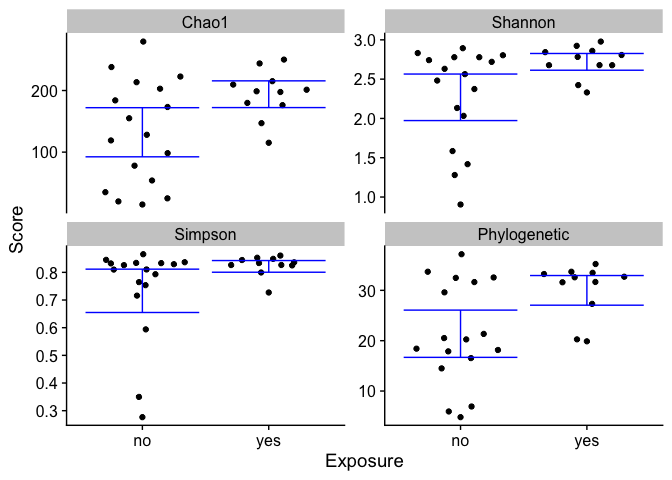

microbData Package
================

- <a href="#installation" id="toc-installation">Installation</a>
- <a href="#tutorial" id="toc-tutorial">Tutorial</a>
  - <a href="#creating-a-microbdata-object"
    id="toc-creating-a-microbdata-object">Creating a <code>microbData</code>
    object</a>
  - <a href="#deal-with-uneven-sampling"
    id="toc-deal-with-uneven-sampling">Deal with uneven sampling</a>
  - <a href="#estimate-diversity" id="toc-estimate-diversity">Estimate
    diversity</a>
  - <a href="#plot-results" id="toc-plot-results">Plot results</a>
- <a href="#use-data-in-with-other-tools"
  id="toc-use-data-in-with-other-tools">Use data in with other tools.</a>

The purpose of this package is to provide tools to make management of
microbiome data (both amplicon and shotgun sequencing) easy in R. It
introduces a new object class, `microbData` that is designed to make it
simple for the user to perform basic microbiome analyses such as alpha-
and beta-diversity estimation, sample and feature filtering, ordination,
etc. The microbData object stores information like what metrics have
been estimated from the data as well as the option to store distance
matrices and ordinations in association with the underlying data to make
it simple for the user to keep track of analysis steps as well as
sharing data and results with colleagues. Furthermore, microbData
objects utilize the power of `data.table`s for fast filtering,
summarizing and merging.

## Installation

``` r
if (!requireNamespace("remotes", quietly = TRUE)) {
  install.packages("remotes")
}
remotes::install_github("kstagaman/microbData")
```

## Tutorial

### Creating a `microbData` object

``` r
library(microbData)
```

    ## Loading required package: ape

    ## Loading required package: data.table

    ## Loading required package: GUniFrac

    ## Loading required package: magrittr

    ## Loading required package: picante

    ## Loading required package: vegan

    ## Loading required package: permute

    ## Loading required package: lattice

    ## This is vegan 2.6-2

    ## Loading required package: nlme

    ## Loading required package: rlang

    ## 
    ## Attaching package: 'rlang'

    ## The following object is masked from 'package:magrittr':
    ## 
    ##     set_names

    ## The following object is masked from 'package:data.table':
    ## 
    ##     :=

    ## Loading required package: stringr

    ## Loading required package: usedist

    ## 
    ## Attaching package: 'microbData'

    ## The following object is masked from 'package:vegan':
    ## 
    ##     rarefy

``` r
## load data
data("metadata_dt")  # creates metadata.dt
setkey(metadata.dt, Sample)
data("asv_mat")      # creates asv.mat
data("taxonomy_dt")  # creates taxonomy.dt
setkey(taxonomy.dt, ASV)
data("phylogeny")    # creates phylogeny


## create microbData object

mD1 <- microbData(
  metadata = metadata.dt,
  abundances = asv.mat,
  features = taxonomy.dt, 
  phylogeny = phylogeny
)
print(mD1)
```

Sample Metadata: 46 samples with 1 covariates Preview: Key: <Sample>
Sample Exposure <char> <fctr> 1: A01 no 2: A02 no 3: A03 no 4: A04 no

Feature Abundances: 2327 features Preview:
TACGGAGGGTGCAAGCGTTAATCGGAATTACTGGGCGTAAAGCGCACGCAGGCGGTTGGATAAGTTAGATGTGAAAGCCCCGGGCTCAACCTGGGAATTG
A01 15593 A02 17508 A03 20974 A04 2565
TACGTATGTCGCAAGCGTTATCCGGATTTATTGGGCGTAAAGCGCGTCTAGGCGGAAAAATAAGTCTGATGTTAAAATGCGGGGCTCAACTCCGTATTGC
A01 12323 A02 874 A03 14247 A04 0
TACGGAGGATCCAAGCGTTATCCGGAATCATTGGGTTTAAAGGGTCTGTAGGCGGTCTTGTAAGTCAGTGGTGAAAGCCCATCGCTCAACGGTGGAACGG
A01 4446 A02 235 A03 5542 A04 0
TACGTAGGGTGCAAGCGTTAATCGGAATTACTGGGCGTAAAGCGTGCGCAGGCGGTTATGCAAGACAGAGGTGAAATCCCCGGGCTCAACCTGGGAACTG
A01 3807 A02 181 A03 4087 A04 105

Feature Assignments: 6 levels assigned Preview: Key: <ASV> ASV <char> 1:
AAAAATGTTTTGACATAAAACACATAAGGATAATACACAGTGATCGATCAAAAAGGGTCATATTTTAATTATGGTGGGAAAAGAATTCTGTTTTTTTATT
2:
AACAGAGGGTGCAAGCGTTATCCGGAATTACTGGGTTTAAAGGGTGCGTAGGCGGTTTGATAAGTCAGTTGTGAAAGGCAGTCGCTTAACGATTGGATTG
3:
AACATAGAGTATAAGACTAAAAGAGAGAATAGAATAAGGTAACAAGATATAAAGAAAGAAGAGAAGAAGAAGAGAATAACGATAAAATGTGTAAGAGCAA
4:
AACATAGGGGGCAAGCGTTGTCCGGAATCACTGGGCGTAAAGGGCGCGCAGGCGGTTTTTTAAGTCAGGTGTGAAAGTTCGGGGCTCAACCCCGTGATGG
Kingdom Phylum Class <char> <char> <char> 1: <NA> <NA> <NA> 2: Bacteria
Bacteroidetes Bacteroidia 3: Bacteria <NA> <NA> 4: Bacteria Firmicutes
Clostridia

Phylogentic Tree: 2327 tips 2326 internal nodes

Sample Names: A01, A02, A03,…, H12

Feature Names:
TACGGAGGGTGCAAGCGTTAATCGGAATTACTGGGCGTAAAGCGCACGCAGGCGGTTGGATAAGTTAGATGTGAAAGCCCCGGGCTCAACCTGGGAATTG,
TACGTATGTCGCAAGCGTTATCCGGATTTATTGGGCGTAAAGCGCGTCTAGGCGGAAAAATAAGTCTGATGTTAAAATGCGGGGCTCAACTCCGTATTGC,
TACGGAGGATCCAAGCGTTATCCGGAATCATTGGGTTTAAAGGGTCTGTAGGCGGTCTTGTAAGTCAGTGGTGAAAGCCCATCGCTCAACGGTGGAACGG,…,
AACCAGCACCTCGAGTGGTCAGGAGGTTTATTGGGCCTAAAGCATCCGTAGCCGGTTGCATAAGTTTTCGGTTAAATCTATGCGCTCAACGTACAGGCCG

``` r
## View individual tables
# View(get.metadata(mD1))
# View(get.abundances(mD1))
# View(get.features(mD1))
# View(get.phylogeny(mD1))
```

We have a lot of ASVs assigned to Eukarya, so let’s get rid of those
first. Also notice that our ASV IDs are sequences, which can be unwieldy
to deal with, and can cause issues with memory usage for really large
data sets. Finally, there are NA assignments in the Features table. So
we’re going to run a couple steps to clean things up.

``` r
mD2 <- remove.eukarya(mD = mD1) %>% 
  numbered.features(prefix = "ASV") %>% 
  rename.NA.features()
print(mD2)
```

Sample Metadata: 46 samples with 1 covariates Preview: Key: <Sample>
Sample Exposure <char> <fctr> 1: A01 no 2: A02 no 3: A03 no 4: A04 no

Feature Abundances: 1462 features Preview: ASV0001 ASV0002 ASV0003
ASV0004 A01 15593 12323 4446 3807 A02 17508 874 235 181 A03 20974 14247
5542 4087 A04 2565 0 0 105

Feature Assignments: 6 levels assigned Preview: Kingdom Phylum Class
Order <char> <char> <char> <char> 1: Bacteria Proteobacteria
Gammaproteobacteria Aeromonadales 2: Bacteria Fusobacteria Fusobacteriia
Fusobacteriales 3: Bacteria Bacteroidetes Bacteroidia Flavobacteriales
4: Bacteria Proteobacteria Gammaproteobacteria Betaproteobacteriales

Phylogentic Tree: 1462 tips 1461 internal nodes

Sample Names: A01, A02, A03,…, H12

Feature Names: ASV0001, ASV0002, ASV0003,…, ASV1462

### Deal with uneven sampling

There are multiple ways to deal with the fact that not all samples are
sequenced to the same depth. The most common method to account for this
is rarefaction. Others include center-log ratio transformation and
variance stabilization of counts. The package can apply all of these
methods to abundance counts (see `?microbData::transform.counts`), as
well as let the user apply their own function to abundances. Here, we
will do some rarefaction. The default behavior for this function is to
rarefy to the lowest sample sum greater than 10,000. This minimum can be
changed, or you can specify an exact number to rarefy to. See
`?microbData::rarefy`.

``` r
mD3 <- rarefy(mD2)
```

    ## Rarefying to: 13000
    ## Random seed: 10403
    ## Number of samples dropped: 18
    ## Number of features dropped: 686

``` r
print(mD3)
```

Sample Metadata: 28 samples with 1 covariates Preview: Key: <Sample>
Sample Exposure <char> <fctr> 1: A01 no 2: A02 no 3: A03 no 4: A05 no

Feature Abundances: 1462 features Preview: ASV0001 ASV0002 ASV0003
ASV0004 A01 3933 3214 1169 1037 A02 11067 616 140 116 A03 4219 2883 1186
818 A05 1492 0 0 0

Feature Assignments: 6 levels assigned Preview: Kingdom Phylum Class
Order <char> <char> <char> <char> 1: Bacteria Proteobacteria
Gammaproteobacteria Aeromonadales 2: Bacteria Fusobacteria Fusobacteriia
Fusobacteriales 3: Bacteria Bacteroidetes Bacteroidia Flavobacteriales
4: Bacteria Proteobacteria Gammaproteobacteria Betaproteobacteriales

Phylogentic Tree: 1462 tips 1461 internal nodes

Sample Names: A01, A02, A03,…, H12

Feature Names: ASV0001, ASV0002, ASV0003,…, ASV1462

Other Data: Abundances rarefied: 13000

Notice, also, the default behavior is to add a note to the Other Data
slot that the abundances have been rarefied and to what depth.

### Estimate diversity

Now, as with most microbiome analyses, we’ll estimate alpha- and
beta-diversity

``` r
mD4 <- alpha.diversity(mD3) %>% # we'll use the default metrics
  beta.diversity(metrics = c("Canberra", "0.5 UniFrac"), ncores = 2)
```

    ## Loading required package: foreach

    ## Loading required package: doParallel

    ## Loading required package: iterators

    ## Loading required package: parallel

Canberra 0.5 UniFrac

``` r
print(mD4)
```

Sample Metadata: 28 samples with 5 covariates Preview: Key: <Sample>
Sample Exposure Shannon Simpson <char> <fctr> <num> <num> 1: A01 no
2.7304019 0.8307820 2: A02 no 0.8865699 0.2726707 3: A03 no 2.8580137
0.8311423 4: A05 no 2.1465017 0.7686043

Feature Abundances: 1462 features Preview: ASV0001 ASV0002 ASV0003
ASV0004 A01 3933 3214 1169 1037 A02 11067 616 140 116 A03 4219 2883 1186
818 A05 1492 0 0 0

Feature Assignments: 6 levels assigned Preview: Kingdom Phylum Class
Order <char> <char> <char> <char> 1: Bacteria Proteobacteria
Gammaproteobacteria Aeromonadales 2: Bacteria Fusobacteria Fusobacteriia
Fusobacteriales 3: Bacteria Bacteroidetes Bacteroidia Flavobacteriales
4: Bacteria Proteobacteria Gammaproteobacteria Betaproteobacteriales

Phylogentic Tree: 1462 tips 1461 internal nodes

Distance Matrices: List of 2; names: Canberra, 0.5 UniFrac

Sample Names: A01, A02, A03,…, H12

Feature Names: ASV0001, ASV0002, ASV0003,…, ASV1462

Other Data: Abundances rarefied: 13000 Alpha.metrics: Chao1, Shannon,
Simpson, Phylogenetic Beta.metrics: Canberra, 0.5 UniFrac

We’ve added the alpha-diversity metrics to the Metadata table, and for
the beta-diversity results, we have a new slot, Distance Matrices, which
contains a list of the `dist` objects.

### Plot results

#### Alpha-diversity

``` r
library(ggplot2)
library(ggbeeswarm)
library(cowplot)
theme_set(theme_cowplot())

plot.dt <- melt(
  get.metadata(mD4), 
  measure.vars = get.other.data(mD = mD4, location = "Alpha.metrics"), 
  # measure.vars = mD4@Other.data$Alpha.metrics # alternative syntax
  variable.name = "Alpha.metric",
  value.name = "Score"
)

ggplot(plot.dt, aes(x = Exposure, y = Score)) +
  geom_quasirandom() + 
  stat_summary(fun.data = "mean_cl_boot", geom = "errorbar", color = "blue") + 
  facet_wrap(~ Alpha.metric, scales = "free_y")
```

<!-- -->

#### Beta-diversity

Before we can plot, we need to ordinate from the distance matrices. Then
we can plot.

``` r
mD5 <- ordinate(mD4, method = "dbRDA", formula = ~ Exposure)
print(mD5)
```

Sample Metadata: 28 samples with 5 covariates Preview: Key: <Sample>
Sample Exposure Shannon Simpson <char> <fctr> <num> <num> 1: A01 no
2.7304019 0.8307820 2: A02 no 0.8865699 0.2726707 3: A03 no 2.8580137
0.8311423 4: A05 no 2.1465017 0.7686043

Feature Abundances: 1462 features Preview: ASV0001 ASV0002 ASV0003
ASV0004 A01 3933 3214 1169 1037 A02 11067 616 140 116 A03 4219 2883 1186
818 A05 1492 0 0 0

Feature Assignments: 6 levels assigned Preview: Kingdom Phylum Class
Order <char> <char> <char> <char> 1: Bacteria Proteobacteria
Gammaproteobacteria Aeromonadales 2: Bacteria Fusobacteria Fusobacteriia
Fusobacteriales 3: Bacteria Bacteroidetes Bacteroidia Flavobacteriales
4: Bacteria Proteobacteria Gammaproteobacteria Betaproteobacteriales

Phylogentic Tree: 1462 tips 1461 internal nodes

Distance Matrices: List of 2; names: Canberra, 0.5 UniFrac

Sample Names: A01, A02, A03,…, H12

Feature Names: ASV0001, ASV0002, ASV0003,…, ASV1462

Other Data: Abundances rarefied: 13000 Alpha.metrics: Chao1, Shannon,
Simpson, Phylogenetic Beta.metrics: Canberra, 0.5 UniFrac Ordinations:
List of 2; names: Canberra_dbRDA, 0.5 UniFrac_dbRDA

``` r
ord.dts <- ordination.coords(mD5, constraint.coords = TRUE)
names(ord.dts$Centroids)[2] <- ord.dts$Centroids$Variable[1]

# some fussing about to make nice axis labels on a faceted plot
# (there's probably a less verbose way to do this)
label.pad <- 1.1
ord.dts$Axis.labs[
  Axis == "Axis1", 
  `:=`(
    Axis1 = ord.dts$Samples[, .(A1 = max(Axis1) * label.pad), by = Beta.metric]$A1,
    Axis2 = ord.dts$Samples[, .(A2 = min(Axis2) * label.pad), by = Beta.metric]$A2
  )
]
ord.dts$Axis.labs[
  Axis == "Axis2", 
  `:=`(
    Axis1 = ord.dts$Samples[, .(A1 = min(Axis1) * label.pad), by = Beta.metric]$A1,
    Axis2 = ord.dts$Samples[, .(A2 = max(Axis2) * label.pad), by = Beta.metric]$A2
  )
]
ord.dts$Axis.labs[
  , `:=`(
    Angle = ifelse(Axis == "Axis1", 0, 90),
    Vjust = ifelse(Axis == "Axis1", 1, 0)
  )
]

# plotting
ggplot(ord.dts$Samples, aes(x = Axis1, y = Axis2)) +
  geom_point(aes(color = Exposure)) +
  geom_point(data = ord.dts$Centroids, aes(color = Exposure), shape = 3, size = 4) + 
  geom_text(
    data = ord.dts$Axis.labs,
    aes(label = Label, angle = Angle, vjust = Vjust),
    hjust = 1,
    color = "gray40"
  ) +
  facet_wrap(~ Beta.metric, scales = "free") +
  theme(
    axis.title = element_blank(), 
    legend.position = "top"
  )
```

<!-- -->

## Use data in with other tools.

While I tried to cover the very basic analyses that most people run on
microbiome data in the package, the reality is that I can’t cover
everything, and there will always be new tools that come out. Thus, my
goal was to make it very easy for people to pull the appropriate tables
out of the `microbData` object and use them *as is* with other tools.
Additionally, with functions like `add.other.data`, you can store data
or notes in the `microbData` object so you can track steps and results
that are not covered here.

I’ve included a couple tools for converting a `microbData` to other
formats, for example `microbData2phyloseq` and `microbData2DESeq`. If
other formats become popular, I will happily add other converting
functions.
